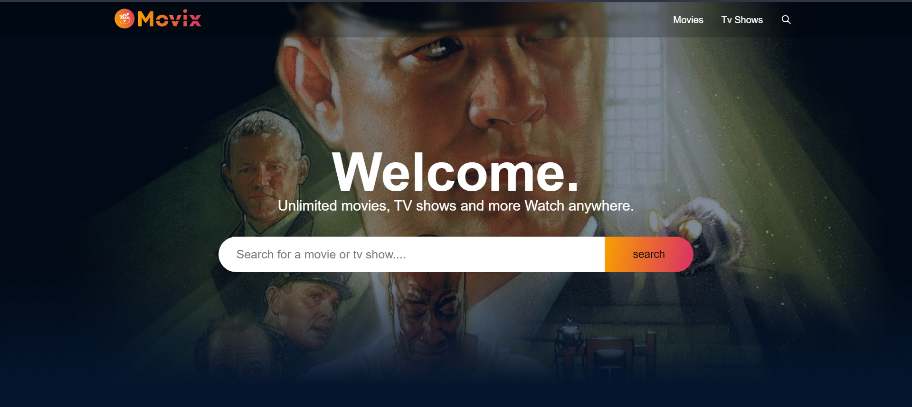

# MOVIX

## Overview
Welcome to the Movie and TV Shows Website! This application is developed using React.js and Redux Toolkit, leveraging the power of TMDB (The Movie Database) API for a seamless and dynamic cinematic experience.

## Features
* ### Dynamic Content :  
Explore a diverse catalog of movies and TV shows with dynamically generated content. Our website fetches real-time data, ensuring that you stay in the loop with the latest releases, popular titles, and trending shows.

* ### Search and Filtering: 
Effortlessly find your favorite content with our powerful search and filtering options. Sort and organize movies and TV shows based on genres, release dates, ratings, and more.

* ### TMDB API Integration: 
We harness the extensive capabilities of the TMDB API to fetch and display a vast array of movie and TV show data. This integration allows us to provide up-to-date information, including details, images, ratings, and more.

* ### Responsive Design: 
Whether you're using a desktop, tablet, or smartphone, our website adapts seamlessly to different screen sizes, ensuring a consistent and enjoyable user experience across devices.

## Getting Started
To run the application locally, follow these steps:

1. Clone the repository: git clone https://github.com/akashnaruka01/MOVIX.git
2. Install dependencies: npm install
3. Obtain your TMDB API key from <a href="https://developer.themoviedb.org/docs/getting-started" target="_blank">TMDB</a> and replace it in the env file. 
4. Start the development server: npm start

## Dependencies
* React.js
* Redux Toolkit
* Axios (for API requests)
* TMDB API

## Contributing
We welcome contributions! Feel free to submit bug reports, feature requests, or pull requests to help enhance the functionality and user experience of our Movie and TV Shows Website.
